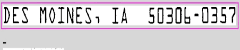
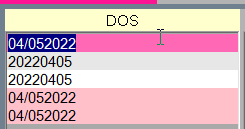
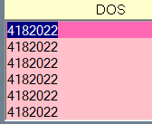

# Plugin Demonstrations
An Optical Character Recognition(OCR) script that quickly completes entries with the ctrl+e hotkey, greatly increasing productivity by reducing the amount of typing required. 

### Hotstrings
For illegible entries where OCR was not helpful, a database of zip codes could be used to reduce some of the typing required. 
 
A selection menu for zip codes with multiple cities. 

### Hotkeys
Combine multiple keystrokes into a single keybind. Ctrl+Arrow Key(up or down) to go up or down one line, copy the text in that line, then paste text contents into the original cursor location. 
 
Quickly prepend a 0 or 1 to dates with a missing digit. 

Additionally, a lot of the default keybinds were remapped for a more efficient workflow and much more!